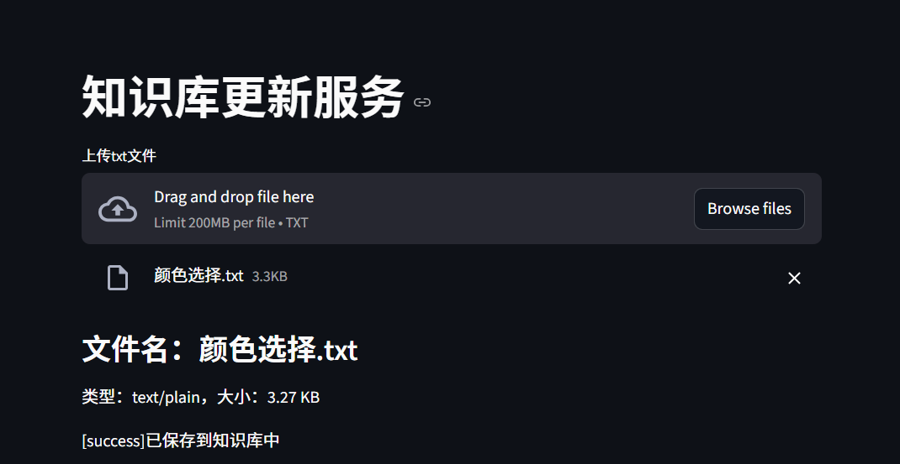
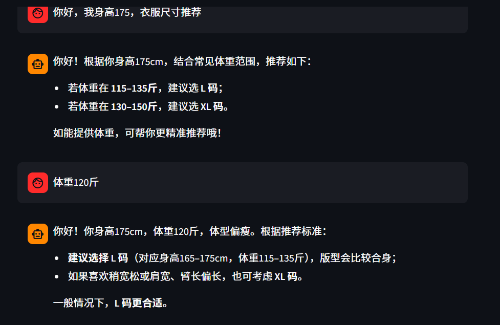

### 知识库服务

#### 使用前提

python中安装需要的库：

例如：

```
pip install streamlit
```

```
pip install langchain
```

以上不完整，请根据个人所缺自行安装其他库

#### 知识库上传服务

##### 使用说明：

进入RAG-KBService中，输入cmd，然后输入

```
python -m streamlit run app_uploader.py
```

##### 效果演示：



#### 智能问答服务

##### 使用说明：

进入RAG-KBService中，输入cmd，然后输入

```
python -m streamlit run app_chat.py
```

##### 效果演示：



